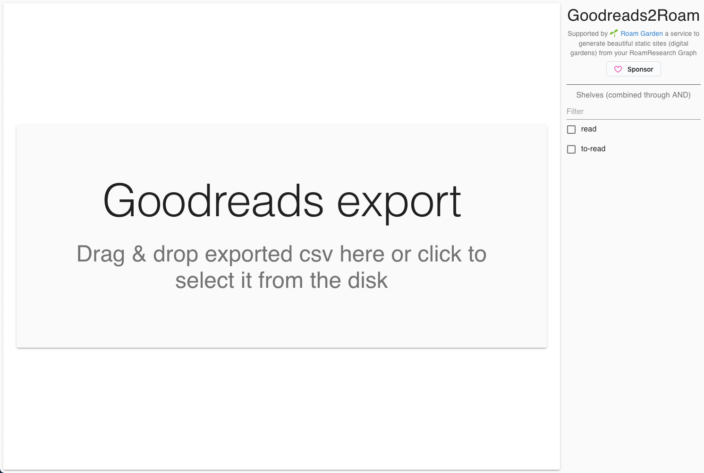

# goodreads2roam
Converts GoodReads csv export into the RoamResearch Markdown.

You can get the source csv file with your books at https://www.goodreads.com/review/import

## Usage

The easiest way to use this is via web app at https://goodreads2.roam.garden/ (it's fully local and you can find it's code [here](https://github.com/Stvad/goodreads2roam-ui))

[](https://goodreads2.roam.garden/)

You can also use it as a CLI by running the `lib/goodreads2roam.js` script directly (nodejs is a requirement)

```
Usage: goodreads2roam [options] input-file output-file

Example: goodreads2roam -s read -s fiction export.csv books.md
This would take books that are in 'read' and 'fiction' shelves from 'export.csv' file
and convert only them to Roam Markdown format writing them to 'books.md' file

Options:
  -s, --shelf SHELF  #{}  Shelves to include (books from all shelves are included by default)
  -h, --help
```

## Development

The project is written in ClojureScript. See [ClojureScript IntelliJ IDEA and shadow-cljs](https://andrearichiardi.com/blog/posts/clojurescript-cursive-shadow-setup.html) for dev setup instructions.

Run `lein run -m shadow.cljs.devtools.cli release script` to build it from the source. 

## Support 

This package and my other OpenSource work is supported by https://roam.garden/ - a service that allows you to publish notes from your Roam Graph as a beautiful static site (digital garden).